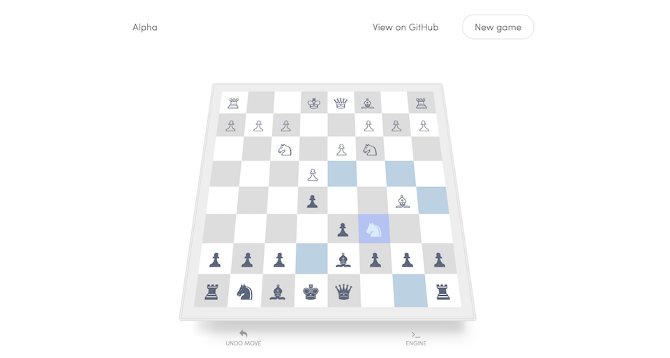

# Alpha - live

just a way to play against [the 150 line ruby chess engine I accidently created](http://github.com/smichaelrogers/alpha)

It's pretty good considering (the hosted version) only get's ~1 second to find a move

